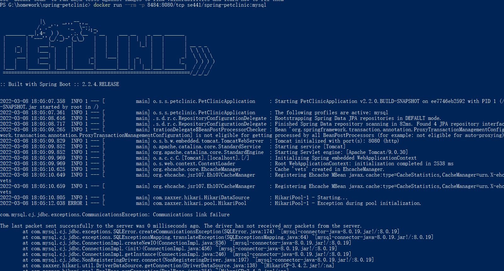

# Instructions
Junhong Chen 2023803

# Deliverables 
- DOCKER
- [5 pts]Your dockerfile. Please provide a link to this file rather than a screen capture.
  [Dockerfile](Dockerfile)
- [5 pts]Your running docker instance as shown by a ps command.
  
- [5 pts]Your browser accessing the main page of the website from your local container.
  
-  DOCKER COMPOSE - MYSQL ONLY
- [5 pts]The output from the docker-compose up command.
  
  
- [5 pts]Your browser accessing the “Veterinarians” page of the website from your local container when you run the application from the host system.
  
- [5 pts]A section of the stack trace generated when you attempt to run the application container that has been updated to use MySQL.
  
  
  
-  DOCKER COMPOSE - APP SERVER AND MYSQL
- [5 pts]Your updated docker-compose.yml file containing the application server, built from your local Dockerfile, and the existing MySQL configuration. Please provide a link to this file rather than a screen capture.
  [docker-compose.yml](docker-compose.yml) 
- [5 pts]Your updated application-mysql.properties file containing the URL change for the database server. Please provide a link to this file rather than a screen capture.
  [application-mysql.properties](src/main/resources/application-mysql.properties)
- [5 pts]The output from the docker-compose up command.
  
- [5 pts]Your browser accessing the “Veterinarians” page of the website from your local container.
  

